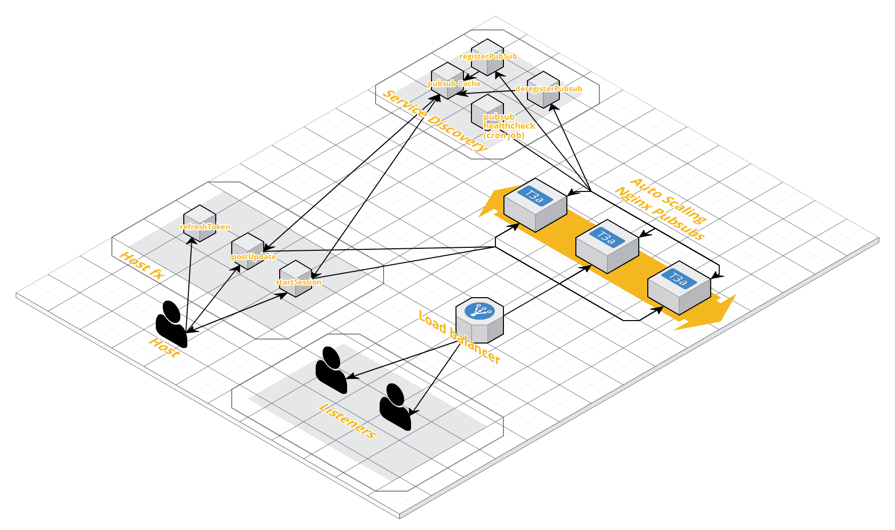

# Pogify / Firebase Cloud Functions

This is the repo that houses all of the code that Pogify uses for its Google Firebase Cloud Functions.

Get more info about Pogify here: https://github.com/Pogify/pogify

Currently Pogify uses Cloud Functions to perform session creation, session authorization, and session token refresh.

## Service Architecture

This is a stretch goal for this project. We hope to reach enough traffic to warrant such an architecture. Currently we run one backend nginx pubsub on a digital ocean droplet.


## Functions

### HTTP Request Triggers

- ### `POST` startSession

  - Starts a session and returns a jwt that claims ownership to the session.
    - A Token is short lived and determines the max session length.
      - Token can be refreshed.
  - `startSession` requires an `Authorization` header with the token obtained from Firebase Auth with an anonymous sign-in.
  - optionally accepts a json body of metadata and simultaneously creates new session and pushes first update. body schema below.
  - authorization is for rate limiting only.
  - function does rate limiting
  - function does a lookup and verifies that a generated session code is not active. If checks pass, a new session record is created on the Realtime DB with a value of the timestamp when this session was started
    - only starting sessions and refreshing tokens will update this value
    - We may remove lookup if we generate codes with more characters (q.v. https://zelark.github.io/nano-id-cc/)

- ### `POST` publishUpdate

  - accepts a json body of metadata to push to listeners.

    - schema:

      ```json
      {
        "timestamp": number,
        "uri": string,
        "position": number,
        "playing": boolean
      }
      ```

      - timestamp: milliseconds since epoch
      - uri: uri of currently playing track
      - position: milliseconds played of current track
      - playing: boolean of whether the current track is playing.

    - the uri string may be empty (ie. `""`) but not undefined. An empty string is sent by a host when it is disconnected.

  - function requires two headers:
    - `Authorization`: auth token from firebase auth
    - `X-Session-Token`: token obtained from `startSession`
  - pushUpdate does not refresh the session record in the Realtime DB

- ### `ANY` refreshToken
  - accepts an old token and returns a new one with new expiry.
  - requires two headers:
    - `Authorization`: auth token from firebase auth
    - `X-Session-Token`: token obtained from `startSession`
  - tokens can only be refreshed once every 25 minutes

### Scheduled Triggers

- [planned] Purge stale session codes from Realtime DB
  - should remove stale session codes periodically.
    - once every few hours
- [planned] Purge old anonymous accounts from Authentication
  - should remove stale anonymous accounts periodically.
    - once a day or something

## Contribution

- development is on the develop branch
- make a pull request to our develop branch
- message an admin
- open an issue

## Developing locally

1. clone this repo: `git clone https://github.com/Pogify/pogify-functions.git`
1. install the [`firebase-cli`](https://firebase.google.com/docs/cli)
1. navigate to the functions folder and `npm install`
1. `firebase --project=fakeproject emulators:start` to start emulators
1. start developing!

Functions have toggles to allow development without proper a proper auth header token.

## Todo

- tests lots of tests
- scheduled functions
